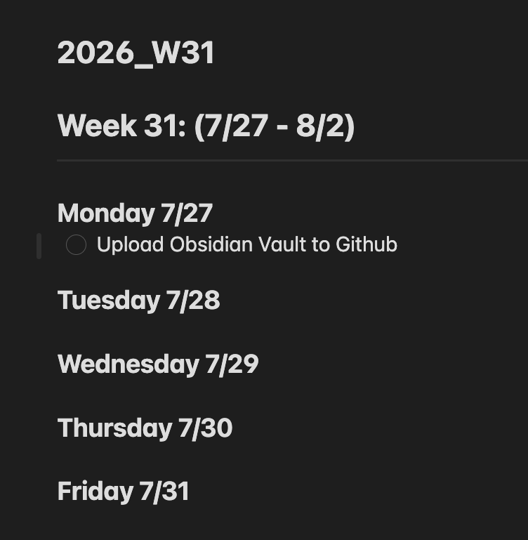
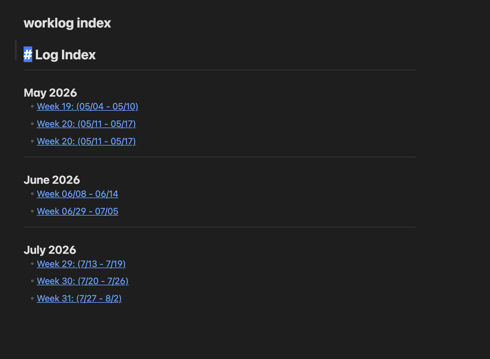

# Worklog


This is an [Obsidian](https://obsidian.md) plugin to create worklogs to fill in
through out the week.

When a worklog is created for the week, it is also appended and linked to a worklog index file.
This makes it easier to find and view your previous worklogs.

My worklog for the current week:


My worklog index:


I do not plan to be add this to the official Obsidian Plugins page now.

## Steps to add plugin
1. Clone the repo:
```sh
git clone https://github.com/adamtruth/obsidian-worklog.git
```
2. Copy the plugin to your Obsidian vault
```sh
cp obsidian-worklog <Your_Vault>/.obsidian/plugins
```
3. In Obsidian Settings -> Community Plugins: enable Worklog.

4. In the Obsidian Settings -> Worklog: Customize to your liking.

## Usage
1. Ctrl+P for your command options (Cmd on Mac)
2. Type "Worklog"
3. Select "Worklog note for the current week"
